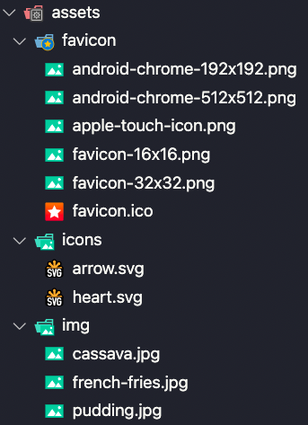
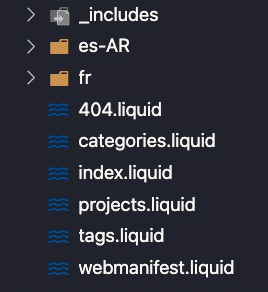
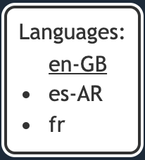

# Portfolio generator

A project that generates a portfolio site for you! All generated from a single json file. Created using [Eleventy](https://www.11ty.dev/).

## Table of contents

- [Portfolios built with it](#portfolios-built-with-it)
- [How to use it](#how-to-use-it)
- [Portfolio.json](#portfoliojson)
  - [Colors](#colors)
  - [i18n](#i18n)
  - [Category](#category)
  - [Tag](#tag)
  - [Project](#project)
  - [Image](#image)
  - [Link](#link)
  - [Video](#video)
- [Assets management](#assets-management)
- [How to make a multilingual portfolio](#how-to-make-a-multilingual-portfolio)
- [License](#license)

## Portfolios built with it

- [Example portfolio](https://jhow.io/portfolio-generator)

- [Jonathan Santos](https://jhow.io/portfolio)

## How to use it

0. Have [`node.js`](https://nodejs.org) installed in your computer (Preferably version 12 or higher).

1. Fork and `git clone` the repository (if not forking, just remember to change the default `git` remote).

2. Run the command `npm install` to install the `npm` dependencies in the project.

3. Edit the `portfolio.json` inside the `src/data` folder with information about your projects and yourself.

4. [Add your assets](#assets-management) (images, videos, favicon, etc.).

5. See the resulting website running the command `npm start`, access the resulting website in [`localhost:3000`](http://localhost:3000).

6. Define if you want to have a multilingual portfolio:

    6.1. If you don't want it, delete `src/data/pt-BR.json`, `src/data/es-MX.json`, `src/templates/pt-BR/` and `src/templates/es-MX`.

    6.2. If you want it, follow the steps in the section [How to make a multilingual portfolio](#how-to-make-a-multilingual-portfolio).

7. Liked the result? Then you have two options for deploying the website:

    7.1. **Github Pages(Easy):≈** Deploy the repository in a github repository ([like this](https://github.com/jonathan-santos/portfolio)), Change the `src/data/portfolio.json` property `root` to `portfolio` ([like this](https://github.com/jonathan-santos/portfolio/blob/main/src/data/portfolio.json#L6)), and then in your computer run the command `npm run deploy`.

    7.2. **Deploy yourself:** Run the command `npm run build`, it will build all the static website files in the folder `public`, you can then copy the folder content and deploy it to different places to deploy your portfolio (many free by the way):
      - [Netifly](https://www.netlify.com/)
      - [Github pages - Manually](https://pages./.github.com/)
      - [Amazon S3](https://aws.amazon.com/free/webapps/?trk=ps_a134p000006gXwDAAU)
      - [Your own dev server](https://kutt.it/7nbVKz)

8. And for the most important step, share your published portfolio, do it in linkedin, in your github profile, in your twitter or any other place you like. But please share it with me, I'd like to see it and, if you would like it, to add in this `README`, I'll be happy to do it 👍.

## Portfolio.json

The file `src/data/portfolio.json` is the file used to configure how the resulting website will be, from colors and styles, to categories and projects, all is in this file (and the different languages like `pt-BR.json` or `es-MX.json`).

For examples `portfolio.json`:

- [Default project - portfolio.json](https://github.com/jonathan-santos/portfolio-generator/blob/main/src/data/portfolio.json) ([Resulting website](https://jhow.io/portfolio-generator))

- [Jonathan Santos - portfolio.json](https://github.com/jonathan-santos/portfolio/blob/main/src/data/portfolio.json) ([Resulting website](https://jhow.io/portfolio))

Here is the reference for the properties and values it accepts:

| Property               | Required | Value         | What it does                                                                                                  | Example                                                       |
|:-----------------------|:--------:|:--------------|:--------------------------------------------------------------------------------------------------------------|:--------------------------------------------------------------|
| name                   | Yes      | Text          | Name that appears at the top of the home page and title of the resulting website                              | `Jonathan`, `Maria`, `Josivaldo`, `Somename Veryunique`       |
| description            | No       | Text          | Text that appears bellow the name of home page and description of the resulting website                       | `Hello there! This is my portfolio`, `Someone's portfolio`    |
| showFooter             | No       | Boolean       | If the default footer should appear                                                                           | `true`, `false`                                               |
| filters                | No       | Boolean       | If the categories and tags filtering system should be activated                                               | `true`, `false`                                               |
| root                   | No       | Text          | The relative link to the site, used if your portfolio site is not in the root of server, like in github pages | `/portfolio`, `/portfolio-generator`, `/something/other/`     |
| colors                 | No       | Object        | Object that contains the colors used in the website                                                           | See bellow the [`colors`](#colors) section                    |
| i18n                   | No       | Object        | Object that contains internationalization configuration                                                       | See bellow the [`i18n`](#i18n) section                        |
| categories             | Yes      | List/Category | The categories that projects can use for identification and filtering                                         | See bellow the [`category`](#category) section                |
| tags                   | Yes      | List/Tag      | The tags that projects can use for identification and filtering                                               | See bellow the [`tag`](#tag) section                          |
| projects               | Yes      | List/Project  | The projects of the portfolio                                                                                 | See bellow the [`project`](#project) section                  |

### Colors
 
Object containg the different colors used in the resulting website, each color is a CSS color, so you can use `Hex`, `RGB` or `HSL`.

| Property         | Required | Value  | What it does                                        | Example              |
|:-----------------|:--------:|:-------|:----------------------------------------------------|:---------------------|
| primary          | No       | Color  | The accent color used in various website locations  | `#0074D9`            |
| text-light       | No       | Color  | The color used by text in dark backgrounds          | `rgb(255, 255, 255)` |
| text-dark        | No       | Color  | The color used by text in light backgrounds         | `hsl(0, 0, 20)`      |
| background-light | No       | Color  | The color used in light backgrounds                 | `white`              |
| background-dark  | No       | Color  | TThe color used in dark backgrounds                 | `rgb(26, 42, 58)`    |

Example:

``` json
"colors": {
  "primary": "#0074D9",
  "text-light": "#FFFFFF",
  "text-dark": "#333333",
  "background-light": "#FFFFFF",
  "background-dark": "#1A2A3A"
},
```

### i18n

Object containg the different styles used in the resulting website, each style affects a different aspect of the resulting website.

| NOTE: Each language should be represented by [`ISO 639-1`](https://www.andiamo.co.uk/resources/iso-language-codes) codes, with the second part being UPPERCASE

| Property | Required | Value     | What it does                                                | Example                                             |
|:---------|:--------:|:----------|:------------------------------------------------------------|:----------------------------------------------------|
| langs    | Yes      | List/Text | The different languages the resulting website should output | `['es-MX', 'pt-BR', 'en-US']`, `['fn-FR', 'es-ES']` |
| default  | Yes      | Text      | The language used in the root of the website                | `en-US`, `ja`, `sv-fi`                              |

Example:

``` json
"i18n": {
  "langs": ["en-US", "pt-BR", "es-MX"],
  "default": "en-US"
},
```

### Category

Object representing a filter used by the projects. Each project can have only 1 category.

| Property | Required | Value  | What it does                   | Example                                |
|:---------|:--------:|:-------|:-------------------------------|:---------------------------------------|
| id       | Yes      | Number | The identifier of the category | `0`, `42`, `9`                         |
| name     | Yes      | Text   | The name of the category       | `Web`, `Games`, `Paintings`            |
| color    | Yes      | Color  | The color of the category      | `#0074D9`, `black`, `rgb(0, 255, 255)` |

Example:

``` json
{
  "id": 0,
  "name": "Dessert",
  "color": "#FF0000"
}
```

### Tag

Object representing a filter used by the projects. Each project can have as many tags as wanted.

| Property | Required | Value  | What it does              | Example                               |
|:---------|:--------:|:-------|:--------------------------|:--------------------------------------|
| id       | Yes      | Number | The identifier of the tag | `0`, `75`, `6`                        |
| name     | Yes      | Text   | The name of the tag       | `Food`, `Tutorials`, `Woodworking`    |
| color    | Yes      | Color  | The color of the tag      | `#0074D9`, `pink`, `rgb(255, 255, 0)` |

Example:

``` json
{
  "id": 0,
  "name": "French",
  "color": "green"
}
```

### Project

Objects that defines how the project is displayed both in preview and in it's own page.

| Property    | Required | Value       | What it does                                                     | Example                                        |
|:------------|:--------:|:------------|:-----------------------------------------------------------------|:-----------------------------------------------|
| id          | Yes      | Number      | The identifier of the project                                    | `0`, `1`, `3050`, `2`                          |
| name        | Yes      | Text        | The name of the project                                          | `Video about cooking`, `How to cook it`        |
| description | No       | Text        | The description of the project                                   | `A video I made showing what is cooking`       |
| category    | No       | Number      | The Id of the category of the project                            | `0`, `29`, `31`, `5`                           |
| tags        | No       | List/Number | The Ids of the tags of the project                               | `[0, 2, 25, 3]`, `[5]`, `[95, 4]`              |
| icon        | Yes      | Image       | The image used by the project review and in the top of it's page | See bellow the [`image`](#image) section       |
| links       | No       | List/Link   | The links to be displayed at the the project page                | See bellow the [`link`](#link) section         |
| images      | No       | List/Image  | The images to be displayed at the project page                   | See bellow the [`image`](#image) section       |
| videos      | No       | List/Video  | The videos to be displayed at the project page                   | See bellow the [`video`](#video) section       |

Example:

``` json
{
  "id": 0,
  "name": "Example project 1",
  "description": "My project 1 is actually a Pudding",
  "category": 0,
  "tags": [0, 2, 5, 16],
  "icon": {
    "src": "pudding.jpg",
    "width": 373,
    "height": 280
  },
  "links": [
    {
      "text": "website",
      "url": "http://www.pudim.com.br"
    },
    {
      "text": "More images of pudding at google",
      "url": "https://www.google.com/search?tbm=isch&q=pudding&tbs=imgo:1"
    }
  ],
  "images": [
    {
      "src": "https://cookingwithdog.com/wp-content/uploads/2017/01/custard-pudding-00.jpg",
      "alt": "A Pudding",
      "width": 1280,
      "height": 720
    },
    {
      "src": "https://www.yummytummyaarthi.com/wp-content/uploads/2017/08/1-9.jpg"
    }
  ],
  "videos": [
    { "src": "https://kutt.it/7nbVKz" },
    { "youtube": "https://www.youtube.com/embed/CpGwrfOzCA0?start=21" }
  ]
},
```

#### Image

Objects containing properties used by images in projects.

| Note: The `src` property that doesn't contain a `http` link to a image, directly links to files contained in the folder `src/assets/img`

| Property | Required | Value  | What it does                                          | Example                                                                                       |
|:---------|:--------:|:-------|:------------------------------------------------------|:----------------------------------------------------------------------------------------------|
| src      | Yes      | Text   | `http` link or file name of image                     | `pudding.png`, `https://cookingwithdog.com/wp-content/uploads/2017/01/custard-pudding-00.jpg` |
| alt      | No       | Text   | The image description used by bots and screen readers | `A pudding`, `A photo of a pudding`, `The pudding I made`                                     |
| width    | No       | Number | Width of the image                                    | `1280`, `1920`                                                                                |
| height   | No       | Number | Height of the image                                   | `720`, `1080`                                                                                 |

Examples:

``` json
{
  "src": "pudding.png"
}
```

``` json
{
  "src": "pudding.png",
  "alt": "A pudding photo"
}
```

``` json
{
  "src": "https://cookingwithdog.com/wp-content/uploads/2017/01/custard-pudding-00.jpg",
  "alt": "A Pudding I totally made",
  "width": 1280,
  "height": 720
}
```

#### Link

Link displayed in the project page

| Note: All links text have the first letter uppercased in the resulting website (ex: `website` will render as `Website`)

| Property | Required | Value | What it does                          | Example                      |
|:---------|:--------:|:------|:--------------------------------------|:-----------------------------|
| text     | Yes      | Text  | The text displayed by the link        | `Website`, `Project running` |
| url      | Yes      | Text  | The URL the link points to            | `https://kutt.it/7nbVKz`     |
 
Example:

``` json
{
  "text": "website",
  "url": "http://www.pudim.com.br"
}
```

#### Video

Objects containing properties used by videos in projects. The video must be provided by one of the properties, with the `youtube` one, resulting in a `iframe` to the video, [like this](https://jhow.io/portfolio-generator/projects/2)

| Note: The `src` property that doesn't contain a `http` link to a video, directly links to files contained in the folder `src/assets/video`

| Property | Required | Value  | What it does                                          | Example                                |
|:---------|:--------:|:-------|:------------------------------------------------------|:---------------------------------------|
| src      | No       | Text   | `http` link or file name of video                     | `makeof.mp4`, `https://kutt.it/7nbVKz` |
| youtube  | No       | Text   | Youtube video                                         | `https://youtu.be/1_q8txKyg4E`         |

Examples:

``` json
{
  "src": "https://kutt.it/7nbVKz"
}
```

``` json
{
  "youtube": "https://youtu.be/1_q8txKyg4E"
}
```

## Assets management

If you want your own Assets (images, videos, favicon, etc.) to be inside the project and the resulting website, you need to put them in specific places in order to appear correctly in the resulting website. All the project assets should be located in `src/assets`.

### Default assets

The project has some assets by default:



As for each folder:

- **favicon:** The [`favicon`](https://www.seoptimer.com/blog/what-is-a-favicon/) folder should not be deleted, but it's content can be updated, more on it [bellow](#favicon).

- **icons:** The `icons` folder should not be deleted, the icons are used in various places in the result website. You should not add any assets in it either, as it's not the right place.

- **img:** The 3 images inside can be safely removed (if you don't want them, which I presume you won't), you can delete the folder if you want, but you'll recreate it later to add your own images.

### Images

To add your own images to the project, like project icons or images, just add them in the folder `src/assets/img`. Then they can be used in projects just by adding their name in respective properties in `portfolio.json`, as an example:

``` jsonc
// src/assets/img/project-icon.png
{
  "projects": [
    {
      "icon": {
        "src": "project-icon.png" 
      }
    } 
  ]
}
```

### Videos

To add your own videos to the project, like project overviews and explanations, just add them in the folder `src/assets/video`. Then they can be used in projects just by adding their name in respective properties in `portfolio.json`, as an example:

``` jsonc
// src/assets/video/project-video.mp4
{
  "projects": [
    {
      "videos": [
        {
          "src": "project-video.mp4" 
        }
      ]
    } 
  ]
}
```

### Favicon

The default [`favicon`](https://www.seoptimer.com/blog/what-is-a-favicon/) looks like this:


In case you want to change it (understandable) just change the files in `src/assets/favicon/`. If you want an easy way to generate a favicon, just access [favicon.io](https://favicon.io/), you can generate one from an image or by text (like the default one above) for free.

## How to make a multilingual portfolio

In order to make a multilingual portfolio you need to add a few properties to `portfolio.json`, create and modify a few files. I will use the example with the languages english, spanish and french, with the default being english:

0. After deciding the languages you will use, get the [`ISO 639-1`](https://www.andiamo.co.uk/resources/iso-language-codes) codes for the language variations you wish, in this example i'll use: `en-GB` (United Kingdom english), `es-AR` (Argentina spanish) and `fr` (standard french).

1. Edit the [`i18n`](#i18n) property in `portfolio.json` with the languages and default language you wish. For example:

    ``` json
    "i18n": {
      "langs": ["en-GB", "es-ar", "fr"],
      "default": "en-GB"
    },
    ```

2. Create text translations in `src/data/translations.json` for the language variations you need. In this example, the modifications would be like this:

    ```jsonc
    {
      "en-GB": {
        // Reused the default `en-US` content
      },
      "es-AR": {
        // Reused the default `es-MX` content
      },
      "fr": {
        "categories": "Catégories",
        "tags": "Mots clés",
        "links": "Liens",
        "images": "Images",
        "videos": "Vidéos",
        "filter": "Filtre",
        "no-filter": "Pas de filtre",
        "active-filter": "Filtre actif",
        "external-link": "ouvre un lien externe dans une nouvelle fenêtre",
        "go-to-home": "Aller à la maison",
        "made-with": "Portfolio réalisé avec",
        "built-with": "Construit avec",
        "back-to-top": "Retour au sommet",
        "arrow-icon": "Icône de flèche",
        "icon": "icône",
        "and": "et",
        "love": "Aimer",
        "by": "par"
      }
    }
    ```

3. Create different language versions of `portfolio.json` in `src/data`, meaning you will add the same content from `portfolio.json`, but with all content with the language you want (for reference, check the [`src/data`](https://github.com/jonathan-santos/portfolio-generator/tree/main/src/data) folder content in the default project). In this example create the files: `es-AR.json` and `fr.json`. You don't need to create one for `en-GB`, because as it is the default language it's content should be in `portfolio.json`. You don't need to add content for properties `showFooter`, `filters`, `root`, `colors` or `i18n`.

4. Edit or copy one of the language folders in `src/templates` like `es-MX` or `pt-BR`, renaming them to the languages you need (except `en-GB` as it is the default language), in this case `es-AR` and `fr`. Delete the older folders (`es-MX`, `pt-BR`) if you have not reused them. The `src/template` folder should now look like this:

    

5. Edit the `data` property with the new language in the files `categories.liquid`, `projects.liquid` and `tags.liquid` inside the language folders you created. For example, in the `categories.liquid` inside folder `fr`:

    - Before:

      ```yaml
      layout: layouts/projects-and-filters
      pagination:
        data: pt-BR.categories
      ```

    - After:

      ```yaml
      layout: layouts/projects-and-filters
      pagination:
        data: fr.categories
      ```

6. All should be ready now. Execute `yarn start`, and in the website the `language-selector` should now show working links to the different language versions of your website:

    

## License

Portfolio-generator is [MIT licensed](https://github.com/jonathan-santos/portfolio-generator/blob/main/LICENSE.md).
